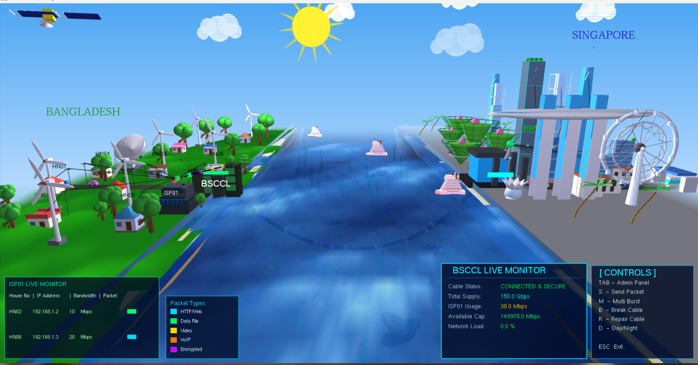
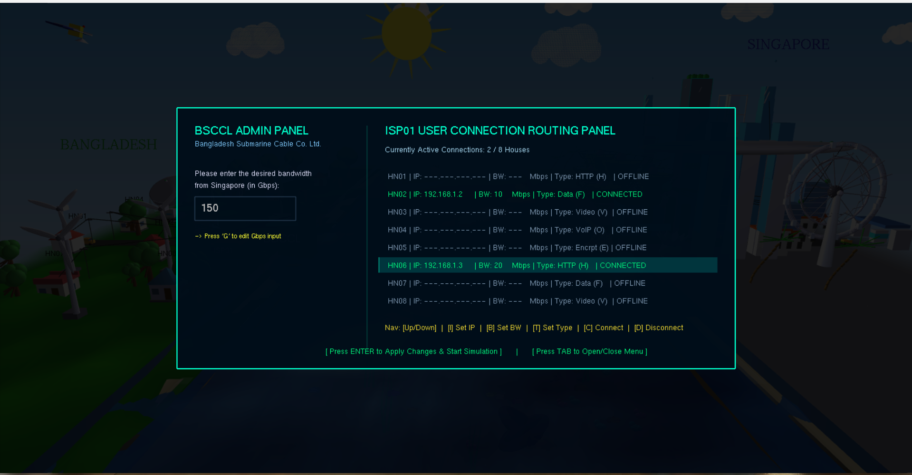
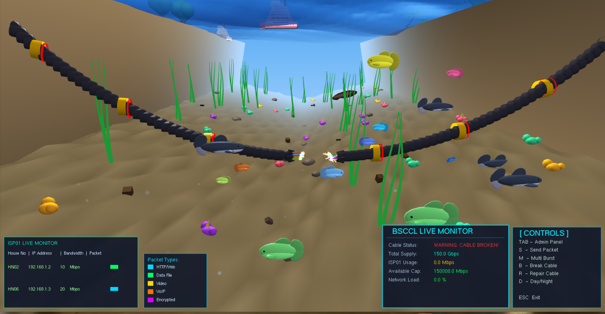
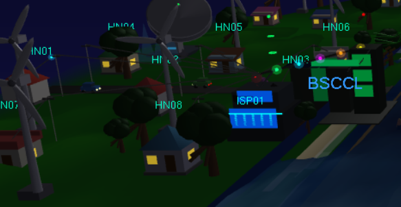

# 🌊 OptiFlux: Cross-Border Network Simulation 🌐


**OptiFlux** is a real-time, interactive **3D network simulation** built entirely in **C** using **OpenGL (GLUT)**.
It visualizes the hidden backbone of the internet—**submarine fiber optic cables**—connecting a rural coastal region of **Bangladesh** to a modern smart city in **Singapore**.

---

## 📸 Screenshots

```markdown
## 📸 Screenshots









---

## ✨ Key Features

### 🖥️ Interactive 2D Admin Panel & HUD

* Custom **2D UI overlay** using `gluOrtho2D`
* Real-time **IP routing & bandwidth allocation system**
* Live monitoring of:

  * Total Capacity
  * ISP Usage
  * Network Load %
* Supports **5 packet types**:

  * HTTP
  * Data
  * Video
  * VoIP
  * Encrypted
    *(Each with unique colors)*

---

### 🧮 Core Mathematical Rendering

* **Cubic Bezier Curves** for realistic cable & packet paths
* **Bresenham’s Line Algorithm** for precise line rendering
* **DDA Algorithm** for architectural structures
* Fully **manual rendering (no external 3D models)**

---

### 🌊 Dynamic Physics & Ecosystem

* Procedural ocean using **multiple sine/cosine waves**
* Realistic wave motion (no static animation)
* **Autonomous movement system** using Euler Integration:

  * Fish 🐟
  * Sharks 🦈
  * Traffic 🚗
* **Buoyancy system** for ships reacting to wave height

---

### ⚡ Hardware Fault Simulation

* Press **B** → simulate cable failure
* Features:

  * Packet drop in real-time
  * Electrical spark effects
  * Network bandwidth drops to **0 instantly**
* Press **R** → repair system and restore flow

---

## 🛠️ Technology Stack

* **Language:** C
* **Graphics API:** OpenGL (GLUT)
* **Compiler:** GCC / MinGW
* **IDE:** Code::Blocks

---

## 🚀 How to Run Locally

### 🐧 Linux

```bash
gcc src/*.c -o optiflux -lGL -lGLU -lglut -lm
./optiflux
```

### 🪟 Windows (MinGW)

* Make sure OpenGL & GLUT are configured
* Compile all `.c` files together
* Run the generated `.exe`

---

## 🎮 Controls

### 🎯 Simulation Controls

* **TAB** → Toggle Admin Panel
* **S** → Send Single Packet
* **M** → Multi Packet Burst
* **B** → Break Cable
* **R** → Repair Cable
* **D** → Day/Night Mode
* **Z / X** → Zoom In / Out

---

### ⚙️ Admin Panel Controls

* **G** → Set Total Bandwidth (Gbps)
* **↑ / ↓** → Select House
* **I** → Set IP Address
* **B** → Set Bandwidth (Mbps)
* **T** → Change Packet Type
* **C / D** → Connect / Disconnect
* **ENTER** → Apply Settings

---

## 👨‍💻 Author

**Md Shaikat Zaman Shipon**
🌐 https://shaikatzaman.com.bd

---

## ⭐ Final Note

This project demonstrates:

* Low-level graphics programming
* Mathematical modeling
* Real-time simulation systems
* Network visualization concepts

If you like this project, consider giving it a ⭐ on GitHub!
